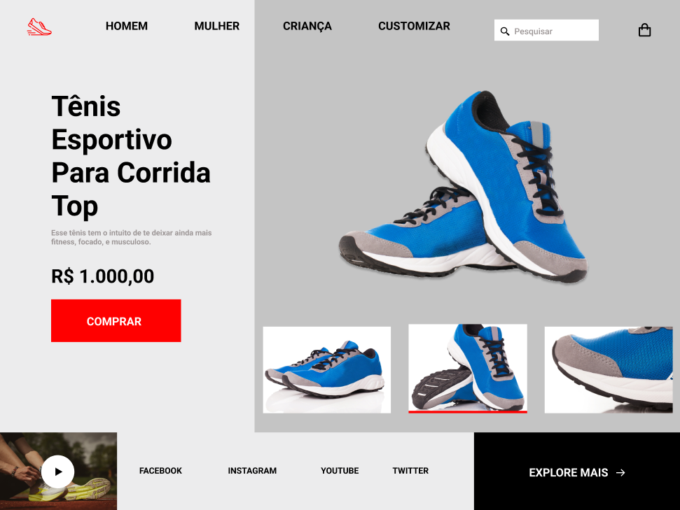

# RocketShoes

## 🎯 Desafio:

Neste desafio, seguindo um layout dado, foi proposto a criação de uma página responsiva de venda de tênis utlizando HTML e CSS.
 
### Layout disponibilizado:

 

## 🚀 Resultado: 

<a href="https://rocketshoes-ashen.vercel.app">Clique aqui para acessar o site</a> 

## ⚒️ Tecnologias utilizadas:
* JavaScript
* HTML
* CSS
